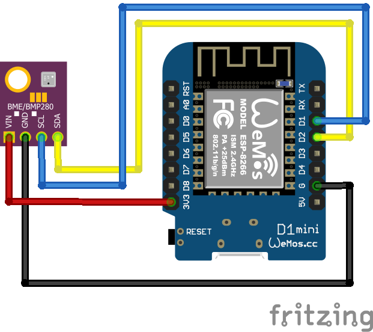
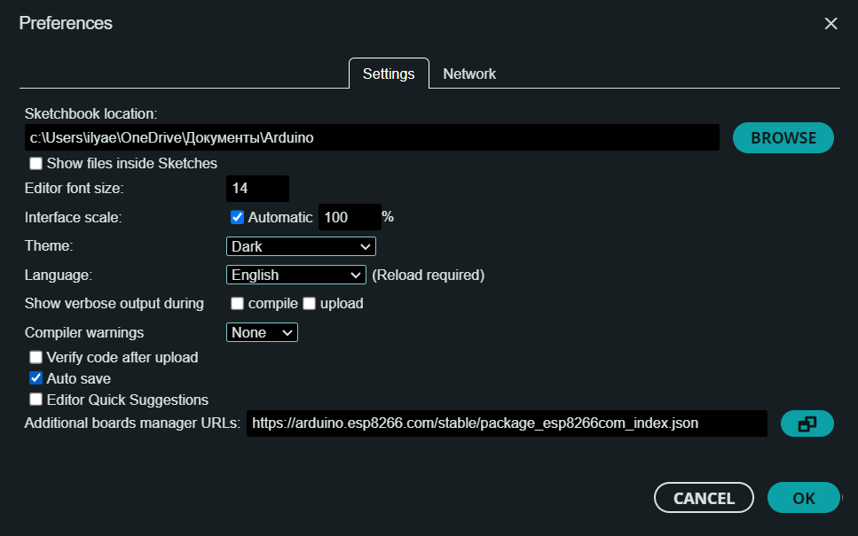
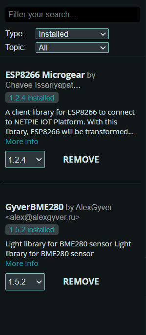
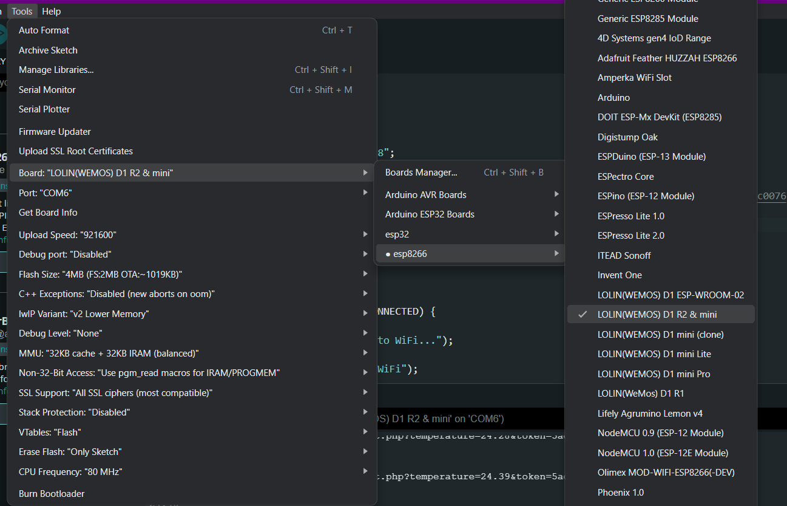
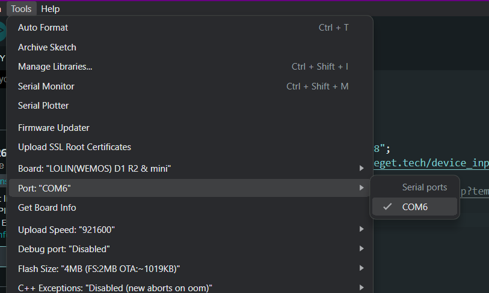

# Подключение микроконтроллера Wemos (lolin) d1 mini к датчику температуры BME280

1. Схема подключения микроконтролера к датчику.

2. Настройка в ArduinoIDE.

File -> Preferences

Вставляем URL: https://arduino.esp8266.com/stable/package_esp8266com_index.json

3. Устанавливаем библиотеки и драйвера.

Библиотеки: GyverBME280, ESP8266 Microgear
Драйвера: CH341SER

4. Настраиваем Board и подключаемся к порту.

5. Загружаем и запускаем файл lold1mini.ino.
